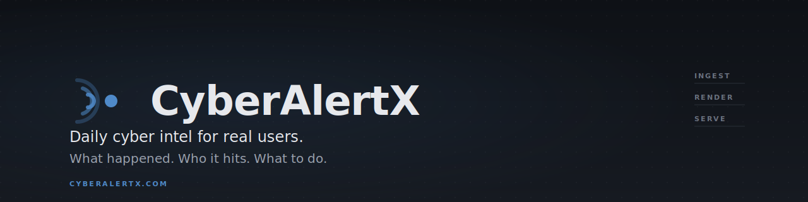

<p align="center">
  
</p>

<p align="center">
  <a href="https://github.com/vyahello/cyberalertx/actions/workflows/ci.yml">
    
  </a>
  
  
  
  
</p>

# CyberAlertX

Cybersecurity intel feed — RSS ingestion → AI editorial render → calm,
scannable feed. Three questions per story: **what happened, who's hit,
what to do**.

- **Backend** — Python 3.11+ (FastAPI + APScheduler + SQLAlchemy 2.0)
- **Frontend** — Next.js 15 (App Router, ISR)
- **AI** — Anthropic Claude Haiku (optional; pipeline runs offline by default)
- **Storage** — JSON (authoritative) + PostgreSQL via Supabase (shadow-write,
  JSON-first reads with PG fallback)

---

## Quick start (JSON only)

The default mode. No database needed.

```bash
# 1. Backend + frontend deps
pip install -r requirements.txt
cd frontend && npm install && cd ..

# 2. Configuration — at minimum set ANTHROPIC_API_KEY if you want AI render
$EDITOR .env

# 3. First ingest cycle (free, no API calls)
python -m cyberalertx.main once

# 4. AI render of the top items (paid; requires ANTHROPIC_API_KEY + --use-llm)
python -m cyberalertx.main generate --limit 15 --use-llm

# 5. Run backend + frontend (two terminals)
python -m cyberalertx.main serve --port 8000
cd frontend && npm run dev          # http://localhost:3000
```

Open `http://localhost:3000/en` or `/ua`.

## Quick start (with Postgres / Supabase)

Same as above but with shadow-write to Postgres. Reads still come from
JSON for news_items; AI cache reads PG-preferred (JSON fallback).

```bash
# 1+2 — same as above (deps install)

# 3. Configuration — set BOTH:
#      ANTHROPIC_API_KEY=sk-ant-...
#      CYBERALERTX_PG_URL=postgresql://... (Supabase Session pooler, port 5432)
#      CYBERALERTX_STORAGE_BACKEND=dual
$EDITOR .env

# 4. Create schema in Postgres (REQUIRED before first `once`)
python -m cyberalertx.tools.pg_migrate

# 5. (If you already have JSON state) backfill existing data into PG
python -m cyberalertx.tools.import_to_postgres            # news_items
python -m cyberalertx.tools.import_ai_cache_to_postgres   # AI cache

# 6. Verify parity — exit code 0 = stores agree
python -m cyberalertx.tools.compare_storage

# 7. Ingest + AI render (now writes to both stores)
python -m cyberalertx.main once
python -m cyberalertx.main generate --limit 15 --use-llm

# 8. Run backend + frontend (two terminals)
python -m cyberalertx.main serve --port 8000
cd frontend && npm run dev
```

**Skipping step 4 (`pg_migrate`) means PG writes will fail silently into
the logs** — JSON keeps working but Postgres stays empty. Always run
migrations before flipping `STORAGE_BACKEND=dual`.

---

## Architecture

```
                ┌─────────────────────────────────────────────┐
RSS feeds ────▶ │  Pipeline: ingest → filter → rank → store   │
                │                                             │
                │            ContentGenerator                 │
                │  rule-based  ←  optional Anthropic LLM      │
                │                                             │
                │            ThreatPost cache                 │
                │       JSON (auth)  +  PostgreSQL (shadow)   │
                └──────────────────┬──────────────────────────┘
                                   │
                              FastAPI surface
                          /posts (newest 15, AI-only)
                          /posts/{id}, /posts/trending
                                   │
                                   ▼
                        ┌────────────────────┐
                        │   Next.js App      │
                        │   /[locale]/...    │  ← en, ua
                        └────────────────────┘
```

**Three-stage offline architecture:**

| Stage | Cost | Trigger | What happens |
|---|---|---|---|
| `ingest` (`once` / `run`) | free | manual or scheduled | RSS → enrich → store |
| `render` (`generate --use-llm`) | paid (Anthropic) | manual | AI journalist render, cached |
| `serve` | free | API requests | cache-hit only, no live AI calls |

The serve path **never** calls Anthropic. Only the `generate` CLI does.

---

## Storage layers

Two stores, both writable, with one source of truth at a time.

| Store | JSON path | PG table | Status |
|---|---|---|---|
| News items | `data/items.json` | `news_items` | dual-write, JSON-read |
| AI cache | `data/threat_posts.json` | `threat_posts` | dual-write, PG-read (JSON fallback) |
| Source health | `data/source_health.json` | — | JSON only |
| Quality metrics | `data/quality_metrics.json` | — | JSON only |
| Feedback | `data/feedback.jsonl` | — | JSON only |

`CYBERALERTX_STORAGE_BACKEND` selects mode:
- `json` (default) — JSON only. Production-safe MVP.
- `dual` — JSON + PostgreSQL. JSON stays write-authoritative; AI cache
  reads PG-first with JSON fallback on miss/error.

Rollback: flip back to `json` in `.env`; nothing breaks.

---

## Backend CLI

All under `python -m cyberalertx.main`.

### `once` — one ingest cycle

```bash
python -m cyberalertx.main once
```

Fetches every configured RSS feed, runs filter / categorize / rank /
credibility / signals, persists to store. **Never calls Anthropic.**
Free.

### `run` — scheduled loop

```bash
python -m cyberalertx.main run                   # 15-min interval (default)
python -m cyberalertx.main run --interval 30     # custom interval
```

Same as `once`, on APScheduler. Use in a tmux/systemd unit for
continuous ingestion.

### `top` — print stored items as JSON

```bash
python -m cyberalertx.main top --limit 10
```

Debug helper. Doesn't touch the AI cache.

### `generate` — AI editorial render

```bash
# Dry-run first — shows missing cache keys and projected API calls
python -m cyberalertx.main generate --limit 15 --use-llm --dry-run

# Real render — costs ~$0.01 per item with Haiku 4.5
python -m cyberalertx.main generate --limit 15 --use-llm

# Force a specific output language for the batch
python -m cyberalertx.main generate --limit 10 --language ua --use-llm

# Whole store (no limit) — expensive; check --dry-run first
python -m cyberalertx.main generate --use-llm
```

Default scope = whole store (within freshness window). `--limit N`
narrows to top-N by `published_at DESC`. Cache hits are free; only
missing `(fingerprint, locale)` pairs incur API calls.

### `serve` — FastAPI on uvicorn

```bash
python -m cyberalertx.main serve                       # 127.0.0.1:8000
python -m cyberalertx.main serve --port 8000 --reload  # dev w/ auto-reload
python -m cyberalertx.main serve --host 0.0.0.0        # expose to network
```

Reads `data/items.json` (or PG news_items in a future PR) and the AI
cache. Re-reads on every request — pick up `generate` runs without
restart.

Endpoints:
- `GET /healthz` — liveness + feed freshness
- `GET /posts?language=en|ua&limit=N` — homepage feed (default 15,
  AI-only, newest first)
- `GET /posts/trending?language=en|ua` — urgent / Critical items
- `GET /posts/latest` — newest by publish time
- `GET /posts/{id}` — detail page; renders fallback if cache miss
- `POST /feedback` — thumbs-up/down signal collection
- `GET /admin/metrics`, `/admin/sources` — JSON observability

---

## Frontend

```bash
cd frontend
npm install               # once
npm run dev               # dev server on :3000
npm run build && npm start   # production
npm run lint
```

`frontend/.env.local` (optional):
```env
NEXT_PUBLIC_API_BASE=http://localhost:8000
```

Routes:
- `/` → redirect to default locale
- `/en` `/ua` → homepage feed
- `/en/threat/{id}` `/ua/threat/{id}` → detail page

---

## Database (Supabase)

PostgreSQL via Supabase. Connection through SQLAlchemy 2.0 + psycopg3
with sane pool defaults.

### One-time setup

1. Create a Supabase project (free tier is fine for MVP).
2. **Project Settings → Database → Connection string → Session pooler**.
   Copy the URL.
3. Put it into `.env` as `CYBERALERTX_PG_URL`. URL-encode any special
   characters in the password (e.g. `?` → `%3F`).
4. Apply schema migrations:
   ```bash
   python -m cyberalertx.tools.pg_migrate --status   # show pending
   python -m cyberalertx.tools.pg_migrate            # apply
   ```
5. Backfill existing JSON state:
   ```bash
   python -m cyberalertx.tools.import_to_postgres            # news items
   python -m cyberalertx.tools.import_ai_cache_to_postgres   # AI cache
   ```
6. Verify parity:
   ```bash
   python -m cyberalertx.tools.compare_storage
   echo $?   # 0 = stores agree
   ```
7. Activate dual-write — in `.env`:
   ```env
   CYBERALERTX_STORAGE_BACKEND=dual
   ```

From now on every `once` / `generate` writes to **both** stores.

### Why Session pooler (port 5432), not Transaction pooler (6543)

Session pooler keeps connections alive per client session — works with
SQLAlchemy's connection pool and prepared statements. Transaction pooler
closes after each transaction; fine for serverless / Edge functions, not
for a sync Python pipeline. Stick with **5432**.

### Migrations

Pure SQL, applied in filename order by the runner:

```
cyberalertx/storage/pg/migrations/
├── 001_init.sql                   # news_items + FTS index
├── 002_threat_posts.sql           # AI cache table
└── 003_threat_posts_denormalized.sql  # feed-friendly indexes + trigger
```

Adding a new one: create `004_*.sql`, re-run `pg_migrate`. Idempotent —
re-applies skip via `schema_migrations` bookkeeping.

### Operational tools

| Command | What |
|---|---|
| `python -m cyberalertx.tools.pg_migrate [--status]` | apply pending DDL |
| `python -m cyberalertx.tools.import_to_postgres [--dry-run] [--limit N]` | one-shot news backfill |
| `python -m cyberalertx.tools.import_ai_cache_to_postgres [--dry-run]` | one-shot AI cache backfill |
| `python -m cyberalertx.tools.compare_storage [--full] [--news-only] [--ai-only]` | diff JSON vs PG; exit code 1 on mismatch |

---

## Configuration (`.env`)

All env vars and their effect. Defaults in code are sane — copy only
what you need to override into `.env`.

### Storage

| Var | Default | Effect |
|---|---|---|
| `CYBERALERTX_STORAGE_BACKEND` | `json` | `json` = JSON only; `dual` = JSON + PG (PG-preferred AI reads) |
| `CYBERALERTX_PG_URL` | unset | Supabase / Postgres URL (use Session pooler, port 5432) |
| `CYBERALERTX_PG_POOL_SIZE` | `2` | idle pool size |
| `CYBERALERTX_PG_MAX_OVERFLOW` | `8` | burst capacity above pool |
| `CYBERALERTX_PG_POOL_RECYCLE_S` | `1800` | connection lifetime |

### AI — Anthropic

| Var | Default | Effect |
|---|---|---|
| `ANTHROPIC_API_KEY` | unset | required for `--use-llm` |
| `CYBERALERTX_AI_PROVIDER` | `anthropic` | provider id (only `anthropic` wired) |
| `CYBERALERTX_AI_MODEL` | `claude-haiku-4-5-20251001` | model id |
| `CYBERALERTX_AI_MAX_TOKENS` | `1200` | output token cap |
| `CYBERALERTX_AI_RETRIES` | `2` | SDK retry budget |
| `CYBERALERTX_AI_CACHE` | `1` | persist generated posts to disk |

The CLI flag `--use-llm` is the **only** way to enable paid Anthropic
calls. There is no env var that does it. The FastAPI serve path is
hard-coded to never call the API — cache hits only, with rule-based
fallback on miss.

### Pipeline

| Var | Default | Effect |
|---|---|---|
| `CYBERALERTX_INTERVAL_MIN` | `15` | scheduler interval for `run` (1-240) |
| `CYBERALERTX_TIMEOUT` | `15` | HTTP timeout for source fetches |
| `CYBERALERTX_UA` | `CyberAlertX/0.1 ...` | User-Agent |
| `CYBERALERTX_MAX_ITEMS` | `5000` | retention cap in JSON store |
| `CYBERALERTX_HALF_LIFE_H` | `12` | freshness half-life in ranker |

### Tests

| Var | Effect |
|---|---|
| `CYBERALERTX_TEST_DB_URL` | enables `tests/test_pg_live.py` (isolated schemas) |

---

## Daily workflow

```bash
# Morning — pull fresh content
python -m cyberalertx.main once

# AI-render the freshest items (cheap with --limit)
python -m cyberalertx.main generate --limit 15 --use-llm

# Verify stores agree (with dual mode on)
python -m cyberalertx.tools.compare_storage

# Run dev environment
python -m cyberalertx.main serve --port 8000 --reload
cd frontend && npm run dev
```

For continuous operation: `python -m cyberalertx.main run` (in tmux /
systemd) replaces the manual `once`. `generate` stays manual to keep AI
costs bounded.

---

## Troubleshooting

**`OperationalError: Network is unreachable` on `db.PROJECT.supabase.co`**
Supabase direct connection resolves only over IPv6. Switch to Session
pooler URL (`aws-0-REGION.pooler.supabase.com:5432`).

**`invalid connection option "pgbouncer"`**
You're on Transaction pooler (port 6543) with `?pgbouncer=true`. Use
Session pooler (5432); psycopg doesn't understand the pgbouncer hint.

**`compare_storage` shows field diffs**
Float precision — already handled with `1e-9` tolerance. If you still
see diffs, run with `--full` and inspect the actual values; mostly it's
new defaults (`audience_relevance_score=0.0`) on older items.

**`generate --use-llm` does nothing (`cache_hits=N`, `missing=0`)**
You already rendered those `(fingerprint, locale)` pairs. Bump `--limit`
to widen scope, or `rm data/threat_posts.json && python -m
cyberalertx.tools.import_ai_cache_to_postgres` (then re-run generate) to
force a refresh from scratch.

**Homepage shows fewer items than `generate --limit 15`**
The feed is `cached_only=True` by default and locale-strict. If
`--limit 15` produced 12 EN renders + 12 UA renders, the EN feed shows
12 (not 15). Run `generate` for a larger limit to refill.

**Feed shows English title on `/ua/threat/{id}`**
Anthropic returned a UA payload with an English title; the read-time
language gate caught it and dropped the locale. Refresh the cache:
```bash
# remove the bad row
python -c "from cyberalertx.storage.pg.threat_cache import PgThreatPostStore; \
           from sqlalchemy import text; \
           from cyberalertx.storage.pg.engine import get_engine; \
           get_engine().begin().__enter__().execute(text(\"DELETE FROM threat_posts WHERE fingerprint='THE_FP' AND locale='ua'\"))"
python -m cyberalertx.main generate --limit 20 --use-llm
```

**Tests skip `test_pg_live.py`**
Expected. Set `CYBERALERTX_TEST_DB_URL` to a separate DB to enable.

---

## Reference

- `cyberalertx/` — Python package
  - `main.py` — CLI entry point (`once`, `run`, `generate`, `serve`, `top`)
  - `pipeline/` — ingest stages
  - `ai/` — AI generator, validation, glossary, editorial refinement
  - `storage/` — JSON + PG backends, factory, dual-write wrappers
  - `api/app.py` — FastAPI application
  - `tools/` — operational CLIs (`pg_migrate`, backfills, compare)
- `frontend/` — Next.js app
- `tests/` — pytest suite (`pytest -q` from repo root)
- `.env` — local secrets (gitignored)
- `data/` — runtime state (gitignored)

License: TBD.
